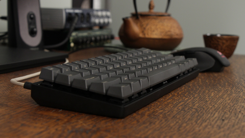

# Vortex POK3R Keyboard Layouts

## Table of Contents

- [Introduction](#introduction)
- [Tips & Tricks](#tips--tricks)
- [Programming Instructions](#programming-instructions)
- [Layer 2 (Blue) for Linux/Windows](#layer-2-blue-for-linux-windows)
- [Layer 3 (Red) for macOS](#layer-3-red-for-macos)
- [Common Bindings](#common-bindings)
- [Move Fn to L_Ctrl](#move-fn-to-l_ctrl)
- [Sources](#sources)

## Introduction

This document contains helpful hints and layout improvements for users
of the popular [Vortex POK3R](http://www.vortexgear.tw/) mechanical
keyboard.  The layouts work with Linux, Windows and macOS.

Multiple sources to buy one:

- [WASD Keyboards](http://www.wasdkeyboards.com/) brand-lables it, provides custom key caps
- [Amazon](http://smile.amazon.com/Mechanical-Keyboard-Keycaps-Cherry-Mx-Blue/dp/B00OFM51L2/),
- [mechanicalkeyboards.com](https://mechanicalkeyboards.com/shop/index.php?l=product_detail&p=1233)

The following layers are used:
- Linux/Windows: Layer 2 (blue LED), switch to it with: `Fn + ,<`
- macOS: Layer 3 (red LED), switch with: `Fn + .>`

## Tips & Tricks

- Toggle arrow-keys on `R_Shift`, `Fn`, `Pn`, and `R_Ctrl`:  `L_Win + R_Alt + Space`
- Factory reset: Hold `L_Alt + R_Alt` keys for five seconds, until LED
  under spacebar stops flashing
- Reset selected layer only: `Fn + R` until LED under spacebar stops flashing

> [POK3R User Manual](docs/POK3R.User.Manual.V1.5.2.pdf); Vortex keeps
> shifting their URLs, so local copy (thanks @couto, @josephfusco)

## Programming Instructions

When the keyboard is in programming mode a second LED will light up on
the right hand side of the space bar.  It starts blinking as soon as you
start the programming of a key and will only turn off when you exit the
programming mode.

- Default layer (`Fn+M`) cannot be programmed
- Enter programming mode: `Fn + R_Ctrl`¹, second LED under space bar lights up
  - Press `key to program`, second LED under spacebar will now blink
  - Enter `new content`, this can be up to 32 characters
  - Confirm with `Pn`, second LED will now stop blinking
- Exit programming: `Fn + R_Ctrl`, second LED goes dark

> **Note:** During programming, use the keys as labelled on the
> keyboard, irrespective of any reassignments.

____
¹ If you've already moved/reassigned your Fn key, as mentioned below, then you
  need to use that key `+ R_Ctrl` to enter/exit programming mode.

## Layer 2 (Blue) for Línux/Windows

`Fn + ,<` to switch to Layer 2

- [Move Fn to L_Ctrl](#move-fn-to-l_ctrl)
- `Fn + R_Ctrl` to enter programming
- [Common bindings](#common-bindings)
- `Fn + R_Ctrl` to exit programming

Resulting programming:

  
Linux/Windows Layout on [keyboard-layout-editor.com](http://www.keyboard-layout-editor.com/##@_name=Pok3r%20Layer%203%20for%20Windows&author=davidjenni&notes=See%20%5Bgithub%5D(https%2F:%2F%2F%2F%2Fgithub.com%2F%2Fdavidjenni%2F%2Fpok3r-layouts)%3B&@_y:1.5&c=%233c4041&t=%23aba18b&p=DCS&a:5%3B&=%0A%0A%0A%0A%60%20~%0A%0AEsc&_a:4%3B&=!%0A1%0A%0A%0AF1&=%2F@%0A2%0A%0A%0AF2&=%23%0A3%0A%0A%0AF3&=$%0A4%0A%0A%0AF4&=%25%0A5%0A%0A%0AF5&=%5E%0A6%0A%0A%0AF6&=%2F&%0A7%0A%0A%0AF7&=*%0A8%0A%0A%0AF8&=(%0A9%0A%0A%0AF9&=)%0A0%0A%0A%0AF10&=%2F_%0A-%0A%0A%0AF11&=+%0A%2F=%0A%0A%0AF12&_w:2%3B&=%0ABackspace%0A%0A%0ADel%3B&@_w:1.5%3B&=%0ATab&=Q&=W&=E&=R%0A%0A%0A%0AReset&=T%0A%0A%0A%0A15ms&=Y%0A%0A%0A%0ACal&=U%0A%0A%0A%0APgUp&_c=%23c7c3b5&t=%23ba1312%3B&=I%0A%0A%0A%0AHome&_c=%233c4041&t=%23aba18b%3B&=O%0A%0A%0A%0APgDn&=P%0A%0A%0A%0APrtSc&=%7B%0A%5B%0A%0A%0AScrlk&=%7D%0A%5D%0A%0A%0APause&_w:1.5%3B&=%7C%0A%5C%3B&@_c=%23c7c3b5&t=%23ba1312&w:1.25&w2:1.75%3B&=%0ACtrl&_x:0.5&c=%233c4041&t=%23aba18b%3B&=A&=S&=D&_c=%23c7c3b5&t=%23ba1312%3B&=F%0A%0A%0A%0APgDn&_c=%233c4041&t=%23aba18b%3B&=G%0A%0A%0A%0A0.1s&_c=%23c7c3b5&t=%23ba1312%3B&=H%0A%0A%0A%0ALeft&=J%0A%0A%0A%0ADown&=K%0A%0A%0A%0AUp&=L%0A%0A%0A%0ARight&_c=%233c4041&t=%23aba18b%3B&=%2F:%0A%2F%3B%0A%0A%0AIns&=%22%0A'%0A%0A%0ADel&_w:2.25%3B&=%0AEnter%3B&@_w:2.25%3B&=%0AShift&=Z&=X&=C&=V&_c=%23c7c3b5&t=%23ba1312%3B&=B%0A%0A%0A%0APgUp&_c=%233c4041&t=%23aba18b%3B&=N%0A%0A%0A%0AEnd&=M%0A%0A%0A%0ADefault&=%3C%0A,%0A%0A%0ALayer%202&=%3E%0A.%0A%0A%0ALayer%203&=%3F%0A%2F%2F%0A%0A%0ALayer%204&_w:2.75%3B&=%0AShift%3B&@_c=%23c7c3b5&t=%23ba1312&w:1.25%3B&=%0AFN&_c=%233c4041&t=%23aba18b&w:1.25%3B&=%0AWin&_w:1.25%3B&=%0AAlt&_p=DCS%20SPACE&w:6.25%3B&=&_p=DCS&w:1.25%3B&=%0AAlt&_c=%23c7c3b5&t=%23ba1312&w:1.25%3B&=%0AWin&_c=%233c4041&t=%23aba18b&w:1.25%3B&=%0APn&_w:1.25%3B&=%0ACtrl)

## Layer 3 (Red) for macOS

`Fn + .` to switch to Layer 3.

- [Move Fn to L_Ctrl](#move-fn-to-l_ctrl)
- `Fn + R_Ctrl` to enter programming
- [Common bindings](#common-bindings)
- Swap Cmd/Opt keys on both sides of space bar:
  - L_Cmd: `L_Alt` then: `L_WIN` then: `Pn`
  - L_Option: `L_WIN` then: `L_Alt` then: `Pn`
  - R_CMD: `R_Alt` then: `R_Fn` (Win) then: `Pn`
  - R_Option: `R_Fn` (Win) then: `R_Alt` then: `Pn`
- `Fn + R_Ctrl` to exit programming

Resulting programming:

  
macOS Layout on [keyboard-layout-editor.com](http://www.keyboard-layout-editor.com/##@_name=Pok3r%20Layer%203%20for%20OSX%2F%2FMac&author=davidjenni&notes=See%20%5Bgithub%5D(https%2F:%2F%2F%2F%2Fgithub.com%2F%2Fdavidjenni%2F%2Fpok3r-layouts)%3B&@_y:1.5&c=%233c4041&t=%23aba18b&p=DCS&a:5%3B&=%0A%0A%0A%0A%60%20~%0A%0AEsc&_a:4%3B&=!%0A1%0A%0A%0AF1&=%2F@%0A2%0A%0A%0AF2&=%23%0A3%0A%0A%0AF3&=$%0A4%0A%0A%0AF4&=%25%0A5%0A%0A%0AF5&=%5E%0A6%0A%0A%0AF6&=%2F&%0A7%0A%0A%0AF7&=*%0A8%0A%0A%0AF8&=(%0A9%0A%0A%0AF9&=)%0A0%0A%0A%0AF10&=%2F_%0A-%0A%0A%0AF11&=+%0A%2F=%0A%0A%0AF12&_w:2%3B&=%0ABackspace%0A%0A%0ADel%3B&@_w:1.5%3B&=%0ATab&=Q&=W&=E&=R%0A%0A%0A%0AReset&=T%0A%0A%0A%0A15ms&=Y%0A%0A%0A%0ACal&=U%0A%0A%0A%0APgUp&_c=%23c7c3b5&t=%23ba1312%3B&=I%0A%0A%0A%0AHome&_c=%233c4041&t=%23aba18b%3B&=O%0A%0A%0A%0APgDn&=P%0A%0A%0A%0APrtSc&=%7B%0A%5B%0A%0A%0AScrlk&=%7D%0A%5D%0A%0A%0APause&_w:1.5%3B&=%7C%0A%5C%3B&@_c=%23c7c3b5&t=%23ba1312&w:1.25&w2:1.75%3B&=%0ACtrl&_x:0.5&c=%233c4041&t=%23aba18b%3B&=A&=S&=D&_c=%23c7c3b5&t=%23ba1312%3B&=F%0A%0A%0A%0APgDn&_c=%233c4041&t=%23aba18b%3B&=G%0A%0A%0A%0A0.1s&_c=%23c7c3b5&t=%23ba1312%3B&=H%0A%0A%0A%0ALeft&=J%0A%0A%0A%0ADown&=K%0A%0A%0A%0AUp&=L%0A%0A%0A%0ARight&_c=%233c4041&t=%23aba18b%3B&=%2F:%0A%2F%3B%0A%0A%0AIns&=%22%0A'%0A%0A%0ADel&_w:2.25%3B&=%0AEnter%3B&@_w:2.25%3B&=%0AShift&=Z&=X&=C&=V&_c=%23c7c3b5&t=%23ba1312%3B&=B%0A%0A%0A%0APgUp&_c=%233c4041&t=%23aba18b%3B&=N%0A%0A%0A%0AEnd&=M%0A%0A%0A%0ADefault&=%3C%0A,%0A%0A%0ALayer%202&=%3E%0A.%0A%0A%0ALayer%203&=%3F%0A%2F%2F%0A%0A%0ALayer%204&_w:2.75%3B&=%0AShift%3B&@_c=%23c7c3b5&t=%23ba1312&w:1.25%3B&=%0AFN&_w:1.25%3B&=%0AOption&_w:1.25%3B&=%0ACMD&_c=%233c4041&t=%23aba18b&p=DCS%20SPACE&w:6.25%3B&=&_c=%23c7c3b5&t=%23ba1312&p=DCS&w:1.25%3B&=%0ACMD&_w:1.25%3B&=%0AOption&_c=%233c4041&t=%23aba18b&w:1.25%3B&=%0APn&_w:1.25%3B&=%0ACtrl)

## Common Bindings

Enter programming mode first.

- CapsLock always as Ctrl:
  - `CapsLock` then: `L_Ctrl` then: `Pn` to confirm
  - `Fn + CapsLock` then: `L_Ctrl` then: `Pn` to confirm
- VI/VIM style HJKL for arrow keys and Page Up/Down:
  - Left: `Fn + H` then: `Fn + J` then: `Pn`
  - Down: `Fn + J` then: `Fn + K` then: `Pn`
  - Up: `Fn + K` then: `Fn + I` then: `Pn`
  - PgDown: `Fn + F` then: `Fn + O` then: `Pn`
  - PgUp: `Fn + B` then: `Fn + U` then: `Pn`
- Home: `Fn + I` then: `Fn + H` then: `Pn`
- Volume controls:
  - Mute: `Fn + X` then: `Fn + /?` then: `Pn`
  - Vol-: `Fn + C` then: `Fn + ,<` then: `Pn`
  - Vol+: `Fn + V` then: `Fn + .>` then: `Pn`

Remember to exit programming mode to activate changes.  See each
respective OS section above.

## Move Fn to L_Ctrl

The VI/VIM style HJKL as cursor keys are more ergonomical to reach by
moving the Fn to the left Ctrl key location.  Note: here you don't need
to go into the programming mode, instead the DIP switch on the back is
used:

- Switch to Layer 2 (or 3, 4); this programming is per layer
- Unplug keyboard
- DIP switch 4 to ON
- Plugin keyboard again, then press `Fn` then: `L_Ctrl` then: `Pn` then: `Pn` (to leave it in its original location)
- DIP switch 4 back to OFF (no need to unplug)

## Sources

The how-to for these mappings is from 2 reddit threads:
- [r/mk: HowTo program pok3r](http://www.reddit.com/r/MechanicalKeyboards/comments/35uy60/guide_howto_program_your_pok3r_programming_layers/)
- [r/mk: HowTo media controls pok3r](http://www.reddit.com/r/MechanicalKeyboards/comments/37j3sx/guide_modification_pok3r_media_volume_controls_hw/)

 This work is licensed under a <a rel="license" href="http://creativecommons.org/licenses/by-sa/4.0/">Creative Commons Attribution-ShareAlike 4.0 International License</a>.
